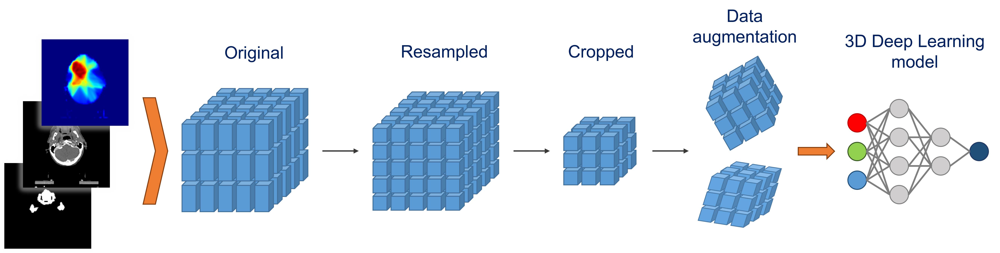
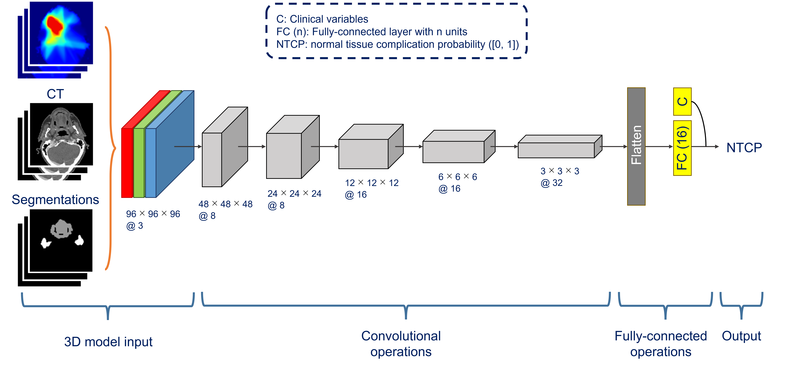

<!---
Markdown syntax: https://www.markdownguide.org/basic-syntax
-->

# Deep Learning-based NTCP modelling


## Running the data preprocessing pipeline



##### Requirements
- Raw dataset folder: see `Data collection` in section `Detailed description` below.
- `endpoints.csv`: for each patient_id: endpoint values (0 or 1) and features for the deep learning and the logistic 
regression model. The features should be in the form such that it does not require any preprocessing 
(e.g. normalization) anymore, because those values in this file will be used directly by the model(s).
- Set the following variables in `data_preproc_config.py` to your own folders. These folders are used for saving the
  (intermediate) preprocessing files:
  - `data_collection_dir` (optional)
  - `save_dir_citor`
  - `save_root_dir`
  - `save_root_dir_2`

##### Run the code
```
# Change directory to data preprocessing folder
$ cd D:\Github\dl_ntcp_xerostomia\data_preproc

# Run main script
$ python main.py
```

<b>Tip: steps in the data preprocessing pipeline can be enabled/disabled in `data_preproc/main.py`.</b>


## Running the model training and evaluation



##### Requirements
- The `datasets` folder from the data preprocessing pipeline (see the variable `data_preproc_config.data_dir`),
containing the folders `0`, `1` and the file `features.csv`.


##### Run the code
```
# Change directory to parent folder
$ cd D:\Github\dl_ntcp_xerostomia

# Run main script
$ python main.py
```


## Warnings and data bugs

(Data)bugs and their corresponding corrections can be found by searching for `# BUG` in the code files.

- (`data_preproc_ct_segmentation_map_citor.py`) The notations in CITOR RTSTRUCTs of a certain structure can 
be slightly different between different files. Notation differences are corrected for and can be found in the function 
modify_structure_citor().
  - `PMC_...` (incorrect) instead of `PCM...` (correct) (`patient_id = 0111766`)
  - `Cricopharyngeus` instead of `crico`
  - `Supraglotticlarynx` instead of `supraglottic` (`patient_id = 5078347`)
- (`data_preproc_ct_segmentation_map_citor.py`) There is an incorrect contour part for `patient_id = 6657004`: slice 101, 
y: 100 - 102, x: 120 - 122 (see segmentation_map[101,97:106,117:126]), structure: `oralcavity_ext`. If we use the 
segmentation maps of all structures (or: at least `oralcavity_ext`) for determining the `x`-dimension cropping region, 
then this incorrect contour will mess up `x_lower` and hence `x_center`.


#### Notes
- Mirada's Deep Learning Contour (DLC) segmentation model was trained on CITOR segmentations.
- Toxicities (to be) used as endpoint/label/class/target/output are: 
  - Xerostomia (dry mouth)
  - Sticky saliva (i.e. mucus)
  - Dysphagia (i.e. swallowing dysfunction)
  - Taste alteration
  - Tube feeding dependence
- The variable `data_preproc_config.use_umcg = True` is used for preprocessing UMCG imaging data. If
`data_preproc_config.use_umcg = False`, then the preprocessing pipeline is designed for preprocessing MDACC imaging data
  (external validation). This variable `use_umcg` was introduced to deal with differences between raw UMCG 
  and MDACC data: length of patient ids, file extensions, folder names, structure names, etc.


## Detailed description


#### Data collection

The data folder structure is assumed to be as follows:

1. For every patient (e.g. `patient_id = 0123456`):
   - `0123456`:
     - `with_contrast` / `no_contrast`:
       - `CT`: `n` DICOM files, where `n` = number of slices.
       - `RTDOSE`: one DICOM file allowed.
       - `RTSTRUCT`: multiple DICOM files allowed.
2. For some patients with missing structures: create and save Mirada's DLC in another 
folder with the following folder structure (e.g. `patient_id = 0123456`):
     - `0123456`
       - `with_contrast` / `no_contrast`:
         - `RTSTRUCT`:
           - one DICOM file allowed.

<b>Important: if a patient has both `with_contrast` and `no_contrast` folder, then the data preprocessing pipeline 
will consider all data in the `with_contrast` folder. However, if certain data folders are not present in 
the `with_contrast` folder (i.e., RTDOSE and/or RTSTRUCT), it will load those from the `no_contrast` counterpart. 
This only holds for the folders that are not available in `with_contrast`. In all cases, it will check whether the 
Frame of Reference (FoR) UID (0020,0052) between the modalities matches.</b>


#### Data preprocessing pipeline

The full data preprocessing pipeline can be run with the files inside the `data_preproc` folder. Moreover, files
outside the `data_preproc` folder are not used in the data preprocessing pipeline

Summary: 
1. Register RTDOSE to CT.
2. Register segmentation map of the relevant structures to CT. See the variable 
`data_preproc_config.structures_compound_list` for the list of relevant structures.
3. Save each of the three arrays (CT, RTDOSE, and segmentation map) as a Numpy array, each with shape
(1, z, y, x) = (num_channels, num_slices, num_rows, num_columns).
4. Extract clinical variables for the deep learning and logistic regression model.

<b>Tip: data preprocessing steps can be enabled/disabled in `main.py`.</b>

##### Terminologies
- `Structure` == `Organ At Risk` (OAR). In the code files we use the notation `structure` (instead of
`Organ At Risk` / `OAR`) because this is conforming the notation in the RTSTRUCT files.
- Segmentation mask vs. map: both are arrays, but a mask is binary (0, 1) while
    a map has integer values (0, 1, 2, ...) with each distinct value corresponding to a different
    structure. E.g. if parotid has value = 6, then map == value will return a mask.
- Relevant structures: structures for which their segmentation that are expected to have impact on the NTCP modeling 
performance. The names of the relevant structures can be found in `data_preproc_config.structure_names_compound_list`. 
<b>Important: the relevant structures are assumed to be non-overlapping. If two (or more) relevant structures are 
overlapping, then we keep the voxel of the relevant structure that has the highest priority. 
The priority is defined in the variable `data_preproc_config.structures_compound_list` (highest priority first).</b>
- Own consistent value map for the structures: different RTSTRUCTs have different segmentation label for the same
structure, e.g. the structure `Parotid_L` could have value = 6 in the segmentation map of an RTSTRUCT, but it could 
have value = 7 in the segmentation map of another RTSTRUCT. To deal with this, we map these inconsistent values to 
consistent values (see the variable `data_preproc_config.structure_names_values`). 
For example, `parotid_li` has always value = 1 in our segmentation map.
- Valid segmentation: if number of voxels for that segmentation >= `data_preproc_config.minimal_count`.


##### Output folders
- `dataset` (from `data_preproc.py`): contains subfolders of each endpoint/classification label. The subfolders contain 
the Numpy arrays of the patients from the corresponding endpoint. 
- `dicom_processed` (from `data_preproc_ct_rtdose.py`): contains CT and RTDOSE (resampled to CT) as Numpy array 
    and are used in the last data preparation step (i.e. `data_preproc.py`).
- `figures` (from `check_data_preproc.py`): contains 2D subplots of CT, RTDOSE and segmentation map for a number of 
equally-distant slices.
- `segmentation_map` (from `data_preproc_ct_segmentation_map.py`): contains the final segmentation maps as Numpy array 
    and are used in the last data preparation step (i.e. `data_preproc.py`). These segmentation maps are 
    combinations of the intermediate segmentation maps from CITOR and DLC.
- `segmentation_map_citor` (from `data_preproc_ct_segmentation_map_citor.py`): contains intermediate segmentation 
    maps as Numpy array, obtained from CITOR RTSTRUCT(s). The segmentation maps only contain voxels of the 
    relevant structures.
- `segmentation_map_dlc` (from `data_preproc_ct_segmentation_map_dlc.py`): contains intermediate segmentation maps 
    as Numpy array, obtained from DLC RTSTRUCT. The segmentation maps only contain voxels of the relevant 
    structures.


##### Steps

The following steps are performed to match/register RTDOSE and segmentation maps to the CTs, 
and made ready as input for 3D deep learing models. Functions in `data_preproc_functions.py` are general functions 
used by the data_preproc files below.

<b>Tip: use the variable `data_preproc_config.test_patients_list` to run the data preprocessing pipeline 
for a subset of patients. This can be useful for doing a test run, or for re-running the pipeline for a 
small subset of patients, which can save a lot of computational time.</b>


1. `data_folder_types.py`
- For every patient: determine which `folder_type` we have to consider, i.e. either `with_contrast` or `no_contrast`. 
This is necessary for loading the correct folders inside the patient's folder. 
<b>Important: if a patient has both `with_contrast` and `no_contrast` folder, then the data preprocessing pipeline 
will consider all data in the `with_contrast` folder. However, if certain data folders are not present in 
the `with_contrast` folder (i.e., RTDOSE and/or RTSTRUCT), it will load those from the `no_contrast` counterpart. 
This only holds for the folders that are not available in `with_contrast`. In all cases, it will check whether the 
Frame of Reference (FoR) UID (0020,0052) between the modalities matches.</b> 


2. `data_collection.py`
- For every patient: using the data in the DICOM headers, check whether the Frame of Reference (FoR) UID 
(0020,0052) between CT, RTDOSE and RTSTRUCT matches or not. The matching of FoR UID is required for 
matching/registrating the images of the different modalities. More information on FoR UID can be found here:
  - https://comp.protocols.dicom.narkive.com/RO1W4rJG/frame-of-reference-uid-tag-question
  - https://discourse.itk.org/t/compose-image-from-different-modality-with-different-number-of-slices/2286/15
  - https://stackoverflow.com/questions/30814720/dicom-and-the-image-position-patient
  - https://dicom.innolitics.com/ciods/rt-plan/frame-of-reference/00200052
  - https://www.ihe.net/uploadedFiles/Documents/Radiation_Oncology/IHE_RO_Suppl_MMRO-III_Rev1.1_TI_2016-11-16.pdf
    (see multimodality_image_registration.pdf in the documents folder).
- Create `invalid_uid.csv` file: list of patient_ids with non-matching CT, RTDOSE and/or RTSTRUCT FoR UID.
- If the RTDOSE does not match with the CT, then the data preprocessing of this patient will still continue. 
This is for time-efficiency: to make sure that the whole data preprocessing pipeline does not suddenly stop.
The patients for which RTDOSE and CT do not match will be added to `exclude_patients.csv` and hence will not be 
considered for the modeling, see `load_data.py`. After their data files have been fixed, we can re-run the 
data preprocessing pipeline for these patients by adding them in `data_preproc.config.test_patients_list`. 
This will prevent us from re-running the data preprocessing pipeline for the whole dataset.
- Tip: non-matching of FoR UID of RTSTRUCTs can be resolved by creating Mirada's DLC using the CT slices 
of interest.


3. `data_preproc_ct_rtdose.py`
- Register RTDOSE array and CT array using sitk.Resample.
- Save CT and RTDOSE metadata (such as `Direction`, `Origin`, `Size`/`Shape`, `Spacing`). The CT metadata is needed for
spacing correction of the different arrays: CT, RTDOSE, segmentation_map.
- Save RTDOSE array (registered to CT) and CT array.


4. `data_preproc_ct_segmentation_map_citor.py`
- Patients can have multiple RTSTRUCTs (`i`=0, 1, ...), each RTSTRUCT can have different structures:
  - Load and save each segmentation map (`segmentation_map_{i}.npy`), structures_value_count, and modified_name
  (`structures_value_count_{i}.json`) to `segmentation_map_citor` folder, where modified_name is our own consistent
  notation of the structure names, because different sources (e.g. CITOR vs. DLC) have different notations for the 
  same structure (e.g. `Parotid_L` vs. `DLC_Parotid_L` --> map both to `parotid_li`).
  - Combine segmentation_maps to obtain best_segmentation_map: 
    - Start with zeros Numpy array.
    - For each relevant structure: 
      - Check which (of the multiple) segmentation has largest count (using `structures_value_count_{i}.json`): 
        - Load the corresponding segmentation map and add its voxels to initial zeros array with value from 
        own consistent value map. 
    - The combined segmentation map (`segmentation_map_citor.npy`) will be saved to `segmentation_map_citor` folder.
    - The combined segmentation map only contains relevant and valid structures.
- Create `overview_all_structures_count_citor.csv` file: contains ALL structures (so for ALL RTSTRUCTs) and their 
corresponding counts. We can use this overview to check all structure names in all RTSTRUCTs, potentially typos. 
For example, for `patient_id = 0111766`, the structure `PCM` was notated as `PMC`.
- Create `overview_structures_count_citor.csv` file: contains the relevant structures for the best RTSTRUCTs and their
corresponding counts. We can use this overview to check whether the relevant structures in the CITOR segmentation_maps
exists, and if so, with how many voxels. If the number of voxels for one or more structure is 0, then we will use
the DLC segmentation map of those structures (see below).


5. `data_preproc_ct_segmentation_map_dlc.py`
- Similar to `data_preproc_ct_segmentation_map_citor.py`. DLC segmentation_maps are created for the patients for which
we do not have CITOR segmentation_maps, or if the CITOR segmentation_maps misses voxels for certain relevant structures. 
- (Difference with previous step) Patients are assumed to have only one RTSTRUCT file. 
- Create DLC segmentation_map, and for the output segmentation map (segmentation_map_dlc.npy): 
  - Start with zeros Numpy array (with same shape as DLC segmentation map).
  - For each relevant structure: 
    - Add its voxels to initial zeros array using own consistent value map. 
  - The segmentation map (`segmentation_map_dlc.npy`) will be saved to `segmentation_map_dlc` folder.
  - The segmentation map only contains the relevant structures.
- Create `overview_structures_count_dlc.csv`: contains the relevant structures and their corresponding counts. We can use 
this overview to check whether the relevant structures in the DLC segmentation_maps exists, and if so, with how many
voxels.
- Note: if a patient has a segmentation map for a relevant structure in both CITOR and DLC, then we will consider the
segmentation map from CITOR instead of DLC.

	
6. `data_preproc_ct_segmentation_map.py`
- Here we combine the CITOR and DLC segmentation_maps. The output contains voxels for every relevant structure (see 
`data_preproc_config.structures_compound_list`), and have value according to `data_preproc_config.structures_values`. 
This is our own consistent value map for the relevant structures. 
<b>Important: the relevant structures are assumed to be non-overlapping. If two (or more) relevant structures are 
overlapping, then we keep the voxel of the relevant structure that has the highest priority. 
The priority is defined in the variable `data_preproc_config.structures_compound_list` (highest priority first).</b>
- For each patient: load `segmentation_map_citor.npy` (if any) and `segmentation_map_dlc.npy` (if any).
- For each relevant structure:
  - Check whether the structure value is valid in `segmentation_map_citor.npy`. 
  - If it is not valid, set `segmentation_map_citor.npy` value for that structure to 0 and add segmentation from 
  `segmentation_map_dlc.npy`. Observe that we will use all valid structures from CITOR and that DLC will only be used 
  to make up for missing structures in CITOR.
  - Note: if the structure has more voxels in DLC than in CITOR, then we will still consider the segmentation
  of CITOR instead of DLC.
  - Perform spacing_correction if `data_preproc_config.perform_spacing_correction = True`. 
- Save the segmentation map (`segmentation_map.npy`) to `segmentation_map` (later in: DICOM_processed) folder.
- The segmentation map only contains the relevant structures and is potentially spacing-corrected.
- Create `overview_structures_count.csv`: contains the relevant structures and their corresponding counts. We can use 
this overview to check whether the relevant structures in the final segmentation_maps exists, and if so, with how many
voxels.
- Determine cropping region from (potentially spacing-corrected) segmentation_map. The cropping region will be used
for cropping a bounding box area of CT, RTDOSE and segmentation map if `data_preproc_config.perform_cropping = True`.
  - `z`: considering parotid, crico and thyroid contours only: obtain most upper and most lower voxel (with value > 0) 
  in z-dimension of the segmentation map.
  - `y`: considering parotid contours only: obtain most upper and most lower voxel (with value > 0) in y-dimension of 
  the segmentation map.
  - `x`: considering parotid and submandibular contours only: obtain most upper and most lower voxel (with value > 0) 
  in x-dimension of the segmentation map.
        
	
7. `data_preproc.py`
- Create `dataset_full` folder: create and store the input Numpy arrays for all patients. 
Note: we also create such arrays for patients that are not included for a specific study (e.g. 
prediction of xerostomia). Those patients are included in one or more other studies, e.g. prediction of dysphagia and/or 
taste. 
- Create `dataset` folder: in this folder we make a distinction between patients of different endpoints/labels 
(`0`, `1`). The following explanation (in strikethrough) is redundant, as the separate folders (i.e., `0` and `1`)
are not required anymore. Moreover, the endpoint value should be specified in the endpoints.csv/features.csv file.
<s>This is required for PyTorch Dataset and DataLoader class objects. Moreover, the dataset folder should 
contain subfolders, where the subfolder names are the endpoint values. The subfolders should contain the Numpy array of 
the corresponding patients. E.g., the subfolder `0` should contain the arrays of the patients with endpoint `0`. 
Similarly for endpoint `1`, endpoint `2` (if any), etc.</s>
- Load CT, RTDOSE and segmentation map Numpy arrays and perform none or some of the following operations. The input 
modalities that could undergo the corresponding operation are indicated in parentheses below.
  - `(z, y, x)`-spacing_correction (CT, RTDOSE). Note: segmentation maps are already spacing-corrected in 
  `data_preproc_ct_segmentation_map.py` if `data_preproc_config.perform_spacing_correction = True`. Therefore, we do not 
  have to perform spacing_correction here.
  - Cropping subset area using bounding box size (CT, RTDOSE, segmentation_map). For the cropping we:
    - Determine the `z/y/x-center` coordinate separately using `z/y/x-upper` and `-lower limits` in `cropping_regions.csv`.
    - Construct a bounding box around this center. The `z/y/x-size` of the bounding box is defined by 
    `data_preproc_config.bb_size`. The bounding box z-coordinate range will be `[z-center - z_size / 2, z_center + z_size / 2]`, 
    similarly for `y` and `x-coordinates`.
    - Crop the array to keep the voxels inside the bounding box. The cropped array will have shape `bb_size`. 
  - Value clipping (CT).
  - Transformation (e.g. resizing) (CT, RTDOSE, segmentation_map).
- These operations are performed based on the boolean value of the variables `perform_spacing_correction`, 
`perform_cropping`, `perform_clipping` and `perform_resize` in `data_preproc_config.py`.
- Add channel dimension, i.e. convert array shape from `(z, y, x)` to `(1, z, y, x)`. This is required for concatenating
the different input modalities to single array.
- Save each imaging (i.e., CT, RTDOSE, and segmentation_map) as separate Numpy arrays in the corresponding patient's
folder in the `dataset` folder.
- Load csv with features (and labels), and save the relevant features. See the variable `data_preproc_config.features` 
for the list of relevant features. 


8. `data_preproc_exclude_patients.py`
- Create a csv file with patient_ids that have invalid data. That is, at least one of the following criteria are met:
  - Invalid dose values, see `data_preproc_config.rtdose_lower_limit` and `.rtdose_upper_limit`.
  - Invalid segmentatioon, i.e. large segmentation fraction outside CT, see `data_preproc_config.max_outside_fraction`
  and `data_preproc_config.max_outside_lower_limit`.
  - Non-matching FoR UID between CT and RTDOSE (see `data_collection.py`).
- By default, we perform data preprocessing for all patients, but patients listed in `exclude_patients.csv` 
will not be considered in the modeling phase (see `load_data.py`).


#### Checks

We perform checks and logging of the different files to make sure that the intermediate and final outputs are 
correctly.

1. `check_folder_structure.py`
- For every patient: check whether its folder structure is as expected. Else the data preprocessing will not work
correctly.
- Create `patients_incorrect_folder_structure.csv`: a table of patient_ids for which the folder structure is incorrect.

2. `check_rtstruct.py`
- Currently not relevant.

3. `check_rtdose.py`
- Currently not relevant.

4. `check_data.py`
- Save `data_preproc_config.structures_values`: {'parotid_li': 1, 'parotid_re': 2, 'submandibular_li': 3, ...} as a
json file.
- Print patient_ids for which we have CITOR data (CT, RTDOSE and/or segmentation), DLC segmentation or neither.

5. `check_data_preproc_ct_rtdose.py`
- Create overview_ct_metadata.csv: a table of CT metadata for all patients.

6. `check_data_preproc_ct_segmentation_map.py`
- Create cropping_regions_stats.csv: a table of descriptive statistics of cropping regions based on the
segmentation_maps.

7. `check_data_preproc.py`
- For all patients: create 2D subplots of CT, RTDOSE and segmentation map for a number of equally-distant slices. 
The figures always contain the subplot of the first and last slice.
- For each patient: the different subplots of the same figure have the same minimum and maximum pixel value,
and therefore are comparable.
- Save the subplots to the `figures` folder.
- Plot CT: we perform windowing by setting the `Window Width (WW) = 600` and `Window Level (WL) = 100`. Moreover, 
the CT values are displayed in the range `[WL - WW / 2, WL + WW / 2] = [-200, +400]`. 
- Plot RTDOSE: contain dose values (cGy unit), where `minimum value = rtdose_arr.min()` (usually = 0 cGy) and 
`maximum value = rtdose_arr.max()` (usually between 6000 and 7500 cGy).
- Plot segmentation: we convert the segmentation maps (with values 0, 1, 2, ..., 
`len(data_preproc_config.structures_uncompound_list)`) to segmentation masks, so these are binary plots.
- For each patient and each structure: calculate the percentage of the structure voxels that are less than or 
equal to the CT's lower limit (e.g. -200 HU). This is to check which structure voxel lies outside the actual human body. 
Many structure voxels outside the human body could indicate an incorrectly matched segmentation map. 
Note: `main_segmentation_outside_ct()` with `ct < data_preproc_config.max_outside_lower_limit` does not work for 
slices with metal artefacts. That is, the metal artefacts changes the HU values of the human body. 
As a result many voxels will be considered outside the human body, but are actually inside the human body.


